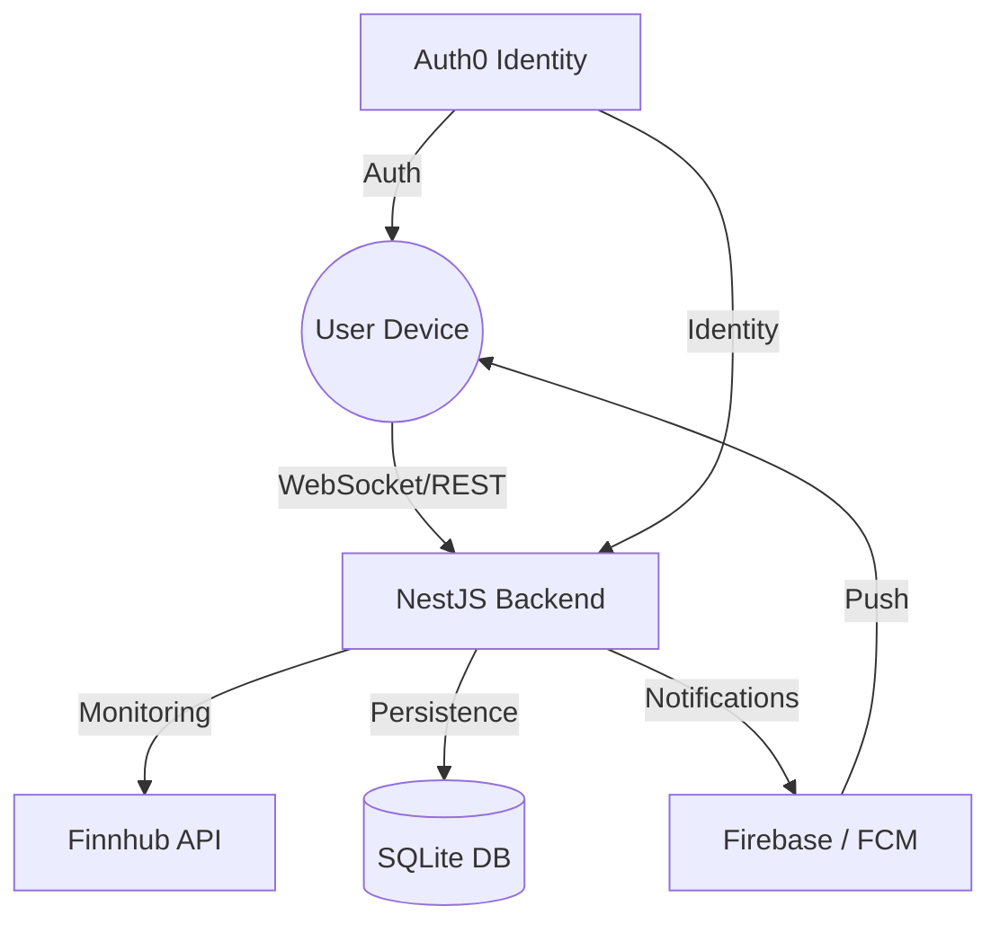

# 📈 Stock Watch App

A premium, real-time stock tracking ecosystem built with **React Native (Expo)** and **NestJS**. Monitor live market movements, analyze trends with high-performance charts, and never miss a price target with server-side alerts and push notifications.

---

## 🌟 Key Highlights

- **Real-time Engine**: Hybrid WebSocket + REST polling strategy for 100% reliable market data.
- **Visual Excellence**: Interactive, 60fps financial charts powered by **Victory Native XL** and **Skia**.
- **Smart Alerts**: Global background monitoring that notifies you even when the app is closed.
- **Enterprise Security**: Secure authentication and identity management via **Auth0**.

---

## 🏗 System Architecture

| Component    | Technology          | Description                                             |
| :----------- | :------------------ | :------------------------------------------------------ |
| **Frontend** | React Native (Expo) | Cross-platform mobile app with Expo SDK 52.             |
| **Backend**  | NestJS (Node.js)    | Scalable, type-safe API managing state and monitoring.  |
| **Database** | SQLite + Prisma     | Lightweight persistence with a powerful type-safe ORM.  |
| **Styling**  | NativeWind          | Utility-first CSS for consistent, rapid UI development. |

---

## 🚀 Getting Started

This repository is split into two main sections. Follow the setup guides in each directory to get up and running:

### 📱 [Mobile Frontend](./frontend/README.md)

> Expo-based application featuring Skia charts and real-time WebSocket integration.

### ⚙️ [NestJS Backend](./backend/README.md)

> High-performance API handling market data streaming, alert evaluation, and FCM notifications.

---

## 🛠 Prerequisites

- **Node.js**: v20 or higher
- **Package Manager**: `npm` or `pnpm`
- **Docker** (Optional): For simplified backend deployment
- **Android Studio**: For mobile development and NDK setup

---

  Developed with ❤️ for the Stock Market Enthusiast.

